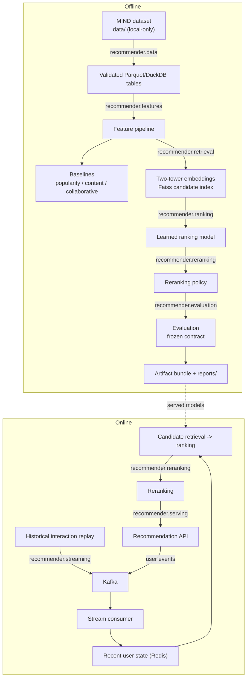

# Architecture

Current state of the implemented system. Every component described here
exists in `src/recommender/` and is exercised by tests. Dated design
history has moved to
[`docs/architecture-decisions.md`](architecture-decisions.md).

## System overview

Two paths share models and artifacts but run on different cadences: an
offline path that learns durable models from historical data, and an
online path that serves recommendations using those models plus recent
user state. Each stage is owned by exactly one package under
`src/recommender/`.

| Path | Stage | Module | Responsibility |
|---|---|---|---|
| Offline | Ingestion and governance | `recommender.data` | Loads MIND, enforces schema, keeps licensed data local-only |
| Offline | Feature pipeline | `recommender.features` | Vectorized feature construction shared with the online path |
| Offline | Candidate retrieval | `recommender.retrieval` | Two-tower embedding model, Faiss `IndexFlatIP` candidate index |
| Offline | Ranking | `recommender.ranking` | Popularity, content and collaborative baselines plus the learned ranking model |
| Offline | Reranking policy | `recommender.reranking` | Diversity and freshness slate construction after ranking |
| Both | Evaluation | `recommender.evaluation` | Metric definitions (Recall@K, NDCG@K, MRR, hit rate, coverage) plus report publication |
| Online | Event streaming | `recommender.streaming` | Historical replay, Kafka producer and consumer, recent user state |
| Online | Serving | `recommender.serving` | Typed recommendation API integrating retrieval, ranking and reranking |
| Both | Observability | `recommender.monitoring` | Structured logging, operational and quality metrics |
| Offline | Experiment tracking | `recommender.tracking` | JSONL log of evaluation runs ([`docs/experiment-tracking.md`](experiment-tracking.md)) |
| Online | Explanation | `recommender.explanation` | Bounded explanation of an already-selected recommendation |

## Data flow

```
Offline
governed MIND dataset (data/, local-only, licensed)
   -> schema and business-rule validation
   -> Parquet / DuckDB analytical tables
   -> feature pipeline
   -> baselines (popularity, content-similarity, collaborative)
   -> two-tower retrieval model -> Faiss candidate index
   -> learned ranking model
   -> reranking policy
   -> evaluation against the frozen contract (docs/research-scenario.md)
   -> versioned artifact bundle + published reports

Online
historical interaction replay
   -> Kafka
   -> stream consumer
   -> recent user state in Redis
   -> candidate retrieval -> ranking -> reranking
   -> recommendation API
   -> user event feedback -> Kafka
```



## Artifact boundaries

The offline path produces a versioned bundle that the online path loads
read-only. Nothing in the serving path writes to it.

| Artifact | Produced by | Consumed by |
|---|---|---|
| Two-tower retrieval model | `recommender.retrieval` | Serving, evaluation |
| Item content vectors (`.npz`) | `recommender.retrieval` | Retrieval, ranking features |
| Faiss `IndexFlatIP` index | `recommender.retrieval` | Serving, evaluation |
| Item catalog | `recommender.data` | Serving, reranking |
| Ranking model | `recommender.ranking` | Serving, evaluation |
| Bundle manifest (SHA-256 per file) | `recommender.retrieval` | Startup validation |

Every bundle member is checksummed in the manifest, and the API validates
those checksums during startup rather than trusting the filenames.

## Runtime dependencies

The API requires the artifact bundle and Redis. It does not require Kafka
at request time: only the offline replay and consumer scripts talk to
Kafka, so API startup is not gated on broker health.

| Service | Required for | Behaviour when unavailable |
|---|---|---|
| Artifact bundle | Startup | Startup fails; `/ready` never becomes ready |
| Redis | Recent user state | Request succeeds; user state degrades to cold-start |
| Kafka | Offline replay and consumption only | No effect on serving |

## Failure and fallback boundaries

- Missing or unreadable artifact bundle stops startup rather than serving
  a silently degraded model.
- Redis unavailability degrades a request to cold-start behaviour instead
  of failing it ([`docs/serving-fallback.md`](serving-fallback.md)).
- A failure inside retrieval, ranking or reranking falls back to
  training-set popularity through `build_fallback_response`.
- The explanation layer only ever consumes a finished
  `RecommendationResponse`; it cannot influence retrieval, ranking or
  reranking ([`docs/explanation-boundary.md`](explanation-boundary.md)).

## Known limitations

- All labels come from exposure-biased MIND logs; see
  [`docs/limitations.md`](limitations.md).
- No untouched final evaluation split remains; validation is
  post-selection development evaluation
  ([`docs/evaluation-protocol.md`](evaluation-protocol.md)).
- Commit-failure behaviour against a live broker is not fully verified
  ([`docs/recovery-testing.md`](recovery-testing.md)).
- There is no production deployment. The container stack is a local
  demonstration.

## Cross-cutting controls

- Feature consistency between training and serving, verified in the
  online feature store
- Deterministic configuration and artifact versioning
- Structured logging and operational metrics
- Latency, throughput, cache hit rate and failure monitoring
- Offline quality evaluation and replay-based simulation, both measured
  against the frozen contract in
  [`docs/research-scenario.md`](research-scenario.md)
- Containerized local execution and CI verification

## Complexity boundary

Spark, Flink, Kubernetes, cloud hosting, distributed TorchRec and a
formal feature store remain out of scope unless a measured requirement
justifies adding one; see
[`docs/distributed-evaluation.md`](distributed-evaluation.md). A small,
local, instruction-tuned model backs the optional explanation layer
([`docs/explanation-boundary.md`](explanation-boundary.md)); it explains
an already-selected recommendation and never participates in retrieval,
ranking or reranking decisions.
