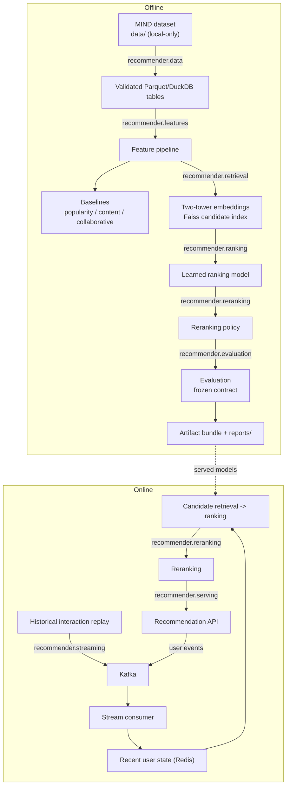

# Architecture

This page describes the system as it works now. For dated design
decisions, see [architecture decisions](architecture-decisions.md).

## The system has two paths

The **offline path** learns from historical MIND data. It validates the
data, builds features, trains retrieval and ranking models, creates the
Faiss index, and publishes evaluation reports.

The **online path** serves recommendations. It combines trained
artifacts with durable user history and recent Redis state, then runs
retrieval, ranking, and reranking before returning a response.

Both paths use the same feature definitions and model artifacts.

## Component map

| Area | Package | Main responsibility |
|---|---|---|
| Data | `recommender.data` | Load MIND, validate records, and keep licensed data local |
| Features | `recommender.features` | Build the same user and item features offline and online |
| Retrieval | `recommender.retrieval` | Train the two-tower model and search the Faiss index |
| Ranking | `recommender.ranking` | Build baselines and score retrieved candidates |
| Reranking | `recommender.reranking` | Apply diversity and freshness policies |
| Evaluation | `recommender.evaluation` | Calculate metrics and publish reports |
| Streaming | `recommender.streaming` | Replay events and consume Kafka messages |
| Serving | `recommender.serving` | Expose the typed recommendation API |
| Monitoring | `recommender.monitoring` | Produce logs, service metrics, and quality signals |
| Tracking | `recommender.tracking` | Record evaluation runs in JSONL |
| Explanations | `recommender.explanation` | Describe an already-selected recommendation |

## Data flow

## What happens during a request

1. The API loads durable features for the user.
2. It asks Redis for recent clicks when Redis is available.
3. It selects one retrieval history: usable recent history, then
   durable history, then global popularity.
4. The two-tower model creates a user query and Faiss returns
   candidates.
5. The ranking model scores those candidates.
6. Diversity and freshness rules build the final slate.
7. The API returns the recommendations, timing data, feature-source
   flags, and an optional explanation.

The explanation code receives a finished `RecommendationResponse`. It
cannot change retrieval, ranking, or reranking.

## How artifacts are checked

Serving reads offline artifacts; it never trains or edits them.

Two checks have different jobs:

### Coherence bundle

`recommender.retrieval.bundle` records hashes for:

- the two-tower retrieval model;
- the item content vectors;
- the item catalog.

`validate_bundle()` checks all three at startup. The API refuses to
start if they do not belong together.

The Faiss `IndexFlatIP` index is not stored in this bundle. It is rebuilt
in memory at startup from the validated retrieval model and catalog.

### Serving-version manifest

`recommender.monitoring.artifact_manifest` creates a broader identity
for the running service. It also covers the ranking model, behavior
splits, configuration, and source commit. The identity is exposed in
`/metrics` as `recommend_model_info`.

This manifest supports observability. It does not perform the
cross-artifact startup check handled by the coherence bundle. The
ranking model must load successfully, but it is not cross-checked
against the retrieval model or catalog.

## Runtime dependencies

| Dependency | Needed for | If it is unavailable |
|---|---|---|
| Valid artifact bundle | API startup | Startup fails |
| Redis | Recent user behavior | Requests continue with durable features |
| Kafka | Replay and streaming updates | The API continues serving |

Kafka is not on the request path. The replay producer and streaming
consumer use it, but API startup does not wait for broker health.

Redis is optional at request time. A Redis failure clears only the
recent-feature input. The trained models and durable features still
produce a personalized response. See
[serving fallback](operations/serving-fallback.md).

## Failure behavior

The service handles only known dependency failures as fallback cases:

- A missing or invalid artifact bundle stops startup.
- A two-tower or Faiss dependency failure returns an explicit
  training-popularity fallback through `build_fallback_response`.
- A Redis failure uses durable-feature personalization and marks the
  dependency as degraded.
- A user with no usable history follows the normal global-popularity
  cold-start path.
- Unexpected ranking, feature, or reranking errors become correlated
  HTTP 500 responses. They are not hidden behind a successful-looking
  popularity response.

These conditions are intentionally different. The response and service
metrics show which path was used.

## Deliberate limits

This is a local research platform, not a production deployment.

- MIND labels reflect exposure bias.
- No untouched final evaluation split remains.
- Live-broker commit-failure behavior is not fully verified.
- Kubernetes, Spark, Flink, distributed TorchRec, cloud hosting, and a
  separate feature store are outside the measured need for this project.

See [limitations](limitations.md),
[evaluation protocol](experiments/evaluation-protocol.md), and
[recovery testing](operations/recovery-testing.md) for details.

## Design principle

The architecture stays small until evidence justifies more
infrastructure. The current code already verifies feature consistency,
artifact identity, structured logging, quality metrics, recovery paths,
container startup, and the main recommendation flow. Adding a
distributed system without a measured need would increase operational
risk without improving the reported result.
