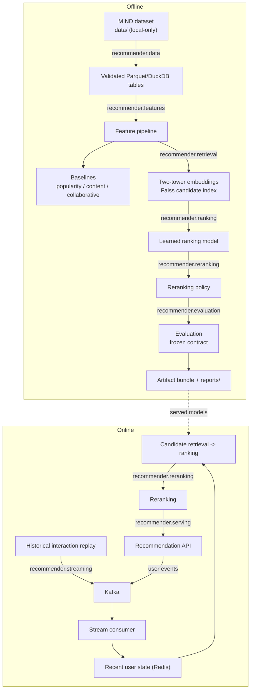

# Architecture

Current state of the implemented system. Every component described here
exists in `src/recommender/` and is exercised by tests. Dated design
history has moved to
[`docs/architecture-decisions.md`](architecture-decisions.md).

## System overview

Two paths share models and artifacts but run on different cadences: an
offline path that learns durable models from historical data, and an
online path that serves recommendations using those models plus recent
user state. Each stage is owned by exactly one package under
`src/recommender/`.

| Path | Stage | Module | Responsibility |
|---|---|---|---|
| Offline | Ingestion and governance | `recommender.data` | Loads MIND, enforces schema, keeps licensed data local-only |
| Offline | Feature pipeline | `recommender.features` | Vectorized feature construction shared with the online path |
| Offline | Candidate retrieval | `recommender.retrieval` | Two-tower embedding model, Faiss `IndexFlatIP` candidate index |
| Offline | Ranking | `recommender.ranking` | Popularity, content and collaborative baselines plus the learned ranking model |
| Offline | Reranking policy | `recommender.reranking` | Diversity and freshness slate construction after ranking |
| Both | Evaluation | `recommender.evaluation` | Metric definitions (Recall@K, NDCG@K, MRR, hit rate, coverage) plus report publication |
| Online | Event streaming | `recommender.streaming` | Historical replay, Kafka producer and consumer, recent user state |
| Online | Serving | `recommender.serving` | Typed recommendation API integrating retrieval, ranking and reranking |
| Both | Observability | `recommender.monitoring` | Structured logging, operational and quality metrics |
| Offline | Experiment tracking | `recommender.tracking` | JSONL log of evaluation runs ([`docs/experiments/experiment-tracking.md`](experiments/experiment-tracking.md)) |
| Online | Explanation | `recommender.explanation` | Bounded explanation of an already-selected recommendation |

## Data flow

```
Offline
governed MIND dataset (data/, local-only, licensed)
   -> schema and business-rule validation
   -> Parquet / DuckDB analytical tables
   -> feature pipeline
   -> baselines (popularity, content-similarity, collaborative)
   -> two-tower retrieval model -> Faiss candidate index
   -> learned ranking model
   -> reranking policy
   -> evaluation against the frozen contract (docs/research-scenario.md)
   -> versioned artifact bundle + published reports

Online
historical interaction replay
   -> Kafka
   -> stream consumer
   -> recent user state in Redis
   -> candidate retrieval -> ranking -> reranking
   -> recommendation API
   -> user event feedback -> Kafka
```



## Artifact boundaries

The offline path produces the artifacts the online path loads read-only.
Nothing in the serving path writes to them. Two distinct mechanisms
cover them, with different scope, and conflating them overstates what
either one actually checks:

**Coherence bundle** (`recommender.retrieval.bundle`,
`serving_bundle.json`): three artifacts that must have been produced
together, because interpreting one against a different version of
another produces plausible-looking nonsense with no error --

| Artifact | Produced by |
|---|---|
| Two-tower retrieval model | `recommender.retrieval` |
| Item content vectors (`.npz`) | `recommender.retrieval` |
| Item catalog | `recommender.data` |

`validate_bundle()` checks all three against the manifest's recorded
SHA-256 hashes at startup and refuses a mismatched set.

**Serving-version manifest** (`recommender.monitoring.artifact_manifest`):
a broader fingerprint -- covering the ranking model, behaviour splits and
serving code commit alongside the three bundle members above -- exposed
through `/metrics` as `recommend_model_info` for observability. It
labels what is running; it does not gate startup or check that its
members agree with each other the way the coherence bundle does.

| Artifact | Covered by |
|---|---|
| Faiss `IndexFlatIP` index | Neither -- rebuilt in memory at every startup from the coherence-bundle-validated retrieval model and catalog, so it cannot itself drift out of agreement with them |
| Ranking model | Serving-version manifest only; required to load at startup, but not cross-checked against the retrieval model or catalog |

## Runtime dependencies

The API requires a valid artifact bundle at startup and optionally uses
Redis for recent state. It does not require Kafka at request time: only
the offline replay and consumer scripts talk to Kafka, so API startup
is not gated on broker health.

| Service | Required for | Behaviour when unavailable |
|---|---|---|
| Artifact bundle | Startup | Startup fails; `/ready` never becomes ready |
| Redis | Recent user state | Request succeeds; falls back to popularity ranking |
| Kafka | Offline replay and consumption only | No effect on serving |

## Fallback behaviour for explicitly recognized dependency failures

- Missing or unreadable artifact bundle stops startup rather than serving
  a silently degraded model.
- A Redis, two-tower or Faiss dependency failure produces the explicit
  popularity fallback (`build_fallback_response`) -- the whole catalog
  ranked by training-set popularity, skipping retrieval, ranking and
  reranking entirely, not the narrower zero-norm-history cold-start
  path that still runs the full pipeline
  ([`docs/operations/serving-fallback.md`](operations/serving-fallback.md)).
  A Redis dependency failure is this fallback, not the same thing as a
  user simply having no recent history.
- Unexpected ranking, feature-construction or reranking errors are not
  caught by this fallback and propagate as correlated 500 responses
  instead of a silently "successful" popularity response.
- The explanation layer only ever consumes a finished
  `RecommendationResponse`; it cannot influence retrieval, ranking or
  reranking ([`docs/experiments/explanation-boundary.md`](experiments/explanation-boundary.md)).

## Known limitations

- All labels come from exposure-biased MIND logs; see
  [`docs/limitations.md`](limitations.md).
- No untouched final evaluation split remains; validation is
  post-selection development evaluation
  ([`docs/experiments/evaluation-protocol.md`](experiments/evaluation-protocol.md)).
- Commit-failure behaviour against a live broker is not fully verified
  ([`docs/operations/recovery-testing.md`](operations/recovery-testing.md)).
- There is no production deployment. The container stack is a local
  demonstration.

## Cross-cutting controls

- Feature consistency between training and serving, verified in the
  online feature store
- Deterministic configuration and artifact versioning
- Structured logging and operational metrics
- Latency, throughput, cache hit rate and failure monitoring
- Offline quality evaluation and replay-based simulation, both measured
  against the frozen contract in
  [`docs/research-scenario.md`](research-scenario.md)
- Containerized local execution and CI verification

## Complexity boundary

Spark, Flink, Kubernetes, cloud hosting, distributed TorchRec and a
formal feature store remain out of scope unless a measured requirement
justifies adding one; see
[`docs/experiments/distributed-evaluation.md`](experiments/distributed-evaluation.md). A small,
local, instruction-tuned model backs the optional explanation layer
([`docs/experiments/explanation-boundary.md`](experiments/explanation-boundary.md)); it explains
an already-selected recommendation and never participates in retrieval,
ranking or reranking decisions.
