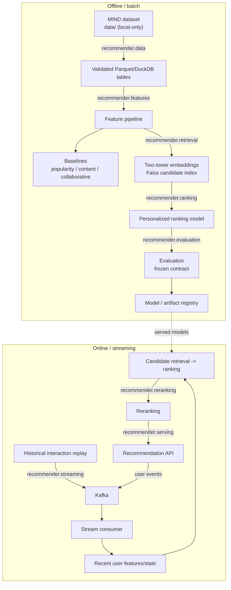

# Architecture

Status: Phase 0 — target architecture and module ownership defined. Data,
modeling, streaming, and serving components are not yet implemented; this
document describes design intent, not built behavior. Sections will be
updated to describe implemented, verified behavior as each phase completes.

## System overview

The system has two paths that share models and artifacts but run on
different cadences: an offline/batch path that learns durable models from
historical data, and an online/streaming path that serves recommendations
using those models plus recent user state. Each stage is planned to be
owned by exactly one package under `src/recommender/`.

| Path | Stage | Planned module | Responsibility |
|---|---|---|---|
| Offline | Ingestion & governance | `recommender.data` | Load MIND, enforce schema, keep raw/licensed data local-only |
| Offline | Feature pipeline | `recommender.features` | Vectorized feature construction; shared contract with the online path |
| Offline | Candidate retrieval | `recommender.retrieval` | Two-tower embedding model, Faiss candidate index |
| Offline | Ranking | `recommender.ranking` | Personalized ranking model scoring retrieved candidates |
| Offline | Reranking policy | `recommender.reranking` | Diversity/freshness slate construction after ranking |
| Both | Evaluation | `recommender.evaluation` | Metric definitions (Recall@K, NDCG@K, MRR, hit rate, coverage) shared by offline evaluation and online replay |
| Online | Event streaming | `recommender.streaming` | Historical replay, Kafka producer/consumer, recent user state |
| Online | Serving | `recommender.serving` | Typed recommendation API integrating retrieval, ranking, reranking |
| Both | Observability | `recommender.monitoring` | Structured logging, operational and quality metrics |

## Data flow

```
Offline / batch (planned)
governed MIND dataset (data/, local-only, licensed)
   -> validation (schema + business rules)
   -> Parquet/DuckDB analytical tables
   -> concise EDA
   -> feature pipeline
   -> baselines (popularity, content-similarity, collaborative)
   -> embedding retrieval model (two-tower) -> Faiss candidate index
   -> personalized ranking model
   -> evaluation against the frozen contract (docs/research-scenario.md)
   -> model/artifact registry

Online / streaming (planned)
historical interaction replay
   -> Kafka
   -> stream consumer
   -> recent user features/state
   -> candidate retrieval -> ranking -> reranking
   -> recommendation API
   -> user event feedback -> Kafka
```

The same two paths, showing where they share models and where they diverge:



### Module ownership (`src/recommender/`)

The eight subpackages created in Step 0.2 map directly onto the stages
above; each currently contains only an `__init__.py` and will gain real
code as its owning phase starts, per the project's lazy-dependency policy.
A ninth subpackage, `recommender.evaluation`, was added in Phase 2 Step
2.1 — see the design-decisions log below for why it wasn't part of the
original eight.

## Cross-cutting controls

- Feature consistency between training and serving (verified in Phase 7)
- Deterministic configuration and artifact versioning
- Structured logging and operational metrics (Phase 12)
- Latency, throughput, cache hit rate, and failure monitoring
- Offline quality evaluation and replay-based online simulation, both
  measured against the single frozen contract in
  [`docs/research-scenario.md`](research-scenario.md)
- Containerized local execution and CI verification

## Complexity boundary

Spark, Flink, Kubernetes, cloud hosting, distributed TorchRec, a formal
feature store, and an LLM are explicitly out of scope unless a measured
requirement in a later phase justifies adding one. The optional Phase 14
explanation layer, if built, explains an already-selected recommendation
and never participates in retrieval, ranking, or reranking decisions.

## Design decisions log

- **2026-08-15** — Fresh start: the prior local checkout and GitHub repo no
  longer existed when this phase began; nothing carried forward from any
  earlier attempt.
- **2026-08-15** — Python pinned to 3.11, not the machine's system-default
  3.14, since PyTorch, Faiss, and TorchRec (needed from Phase 3 onward)
  typically lag behind the newest CPython release.
- **2026-08-15** — Dependencies are added only when the phase that needs
  them starts, rather than declared up front, to avoid stale or unused
  pins accumulating over a long-running project.
- **2026-08-15** — `.gitignore`'s initial `data/` pattern was unanchored
  and matched `src/recommender/data/` (a real source package) in addition
  to the intended root-level dataset folder. Caught by reading `git
  status` after staging, before the first commit; fixed by anchoring the
  pattern to `/data/`.
- **2026-08-15** — CI runs on `ubuntu-latest` rather than mirroring local
  Windows development, since the codebase is pure Python with no
  OS-specific behavior at this stage. Revisit if a future dependency
  (Faiss, a Kafka client) introduces platform-specific build requirements.
- **2026-08-15** — The research contract (`docs/research-scenario.md`) was
  frozen before any repository or code existed, including an explicit
  separation between N (retrieval-stage candidate count) and K (served
  Top-K), since RQ1 and RQ2 evaluate different quantities and must not be
  conflated in later reporting.
- **2026-08-16** — Added `recommender.evaluation`, a ninth subpackage not
  present in the guide's original eight-package skeleton. Metric
  definitions (Recall@K, NDCG@K, MRR, hit rate, coverage) don't belong to
  any single existing package: they're not the ranking model itself
  (`recommender.ranking`), and they're consumed by both the offline
  evaluation path and the online replay path, so folding them into either
  one would misattribute ownership. A dedicated package keeps the metric
  contract in one place that both paths import from.
